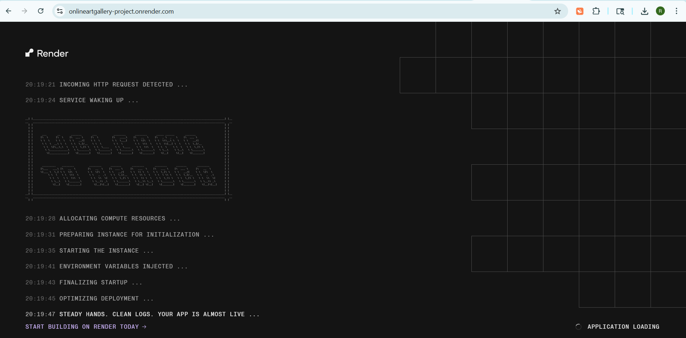
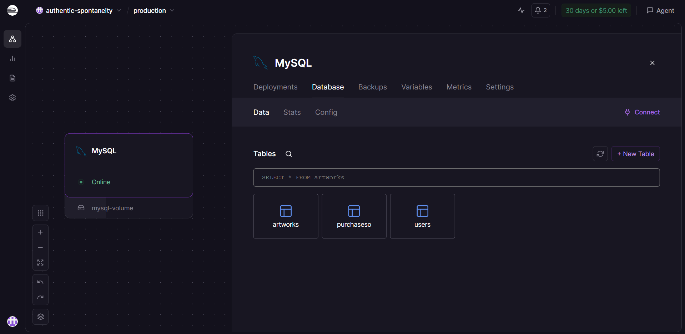
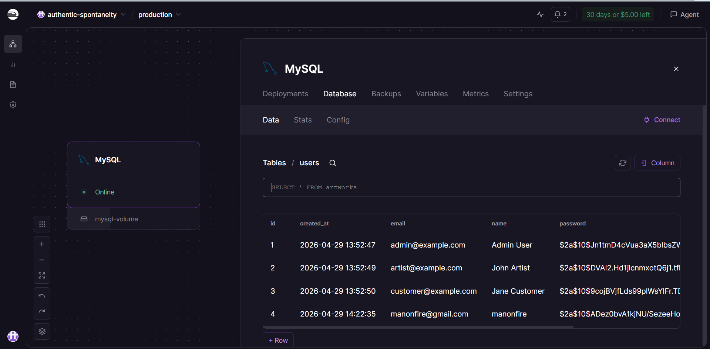

<p align="center">
  
</p>

<h1 align="center">🎨 Online Art Gallery — Backend</h1>
<p align="center">Spring Boot REST API for the Online Art Gallery platform</p>


---
## 🔗 Full Project Repository

👉 https://github.com/shaikreshmashaik2007-afk/FSAD_ONLINE_ART_GALLERY_FRONTEND_AND_BACKEND.git


---

<p align="center">
  
  
  
  
  
</p>

---

## 🌐 Live API

- **Backend (Render):** 👉 https://onlineartgallery-project.onrender.com
- **Frontend (Vercel):** 👉 https://online-art-gallery-frontend.vercel.app/

> ⚠️ The root URL `/` returns `403` — this is expected. The API is protected by Spring Security. Use `/api/auth/login` or `/api/artworks` to interact with the API.

---

## 🧰 Tech Stack

| Layer | Technology |
|-------|------------|
| **Framework** | Spring Boot 3.1.5 |
| **Language** | Java 21 |
| **Security** | Spring Security + JWT |
| **Database** | MySQL (hosted on Railway) |
| **ORM** | Hibernate / Spring Data JPA |
| **Payment** | Razorpay Java SDK |
| **Containerization** | Docker |
| **Deployment** | Render (Docker) |

---

## ✨ Features

- 👤 **JWT Authentication** — register, login, token-based access
- 🖼 **Artwork CRUD** — list, view, add, edit, delete artworks
- 🔒 **Protected Endpoints** — secured with Spring Security filter chain
- 🛒 **Razorpay Payment Integration** — create and verify orders
- 👨‍💼 **Admin Role** — manage the gallery catalog
- 🐳 **Dockerized** — runs in a container on Render


---
---

## 📸 Deployment & Database Snapshots

### 🚀 Backend Server Running (Render)



---

### 🗄 MySQL Tables (Railway)



---

### 👤 Users Login Data (Railway)



---


---

## 🔑 API Endpoints

### Auth
| Method | Endpoint | Description |
|--------|----------|-------------|
| POST | `/api/auth/register` | Register a new user |
| POST | `/api/auth/login` | Login and receive JWT token |

### Artworks
| Method | Endpoint | Description | Auth Required |
|--------|----------|-------------|---------------|
| GET | `/api/artworks` | Get all artworks | ❌ |
| GET | `/api/artworks/{id}` | Get artwork by ID | ❌ |
| POST | `/api/artworks` | Add new artwork | ✅ Admin |
| PUT | `/api/artworks/{id}` | Update artwork | ✅ Admin |
| DELETE | `/api/artworks/{id}` | Delete artwork | ✅ Admin |

### Payments
| Method | Endpoint | Description | Auth Required |
|--------|----------|-------------|---------------|
| POST | `/api/payments/create-order` | Create Razorpay order | ✅ |
| POST | `/api/payments/verify` | Verify payment | ✅ |

---

## ⚡ Local Setup

### Prerequisites

- Java 21+
- Maven 3.9+
- MySQL (local) or Railway MySQL public URL
- Docker (optional)

### Steps

```bash
# 1. Clone the repository
git clone https://github.com/shaikreshmashaik2007-afk/Online-Art-Gallery-BackEnd.git

# 2. Navigate to the backend folder
cd Online-Art-Gallery-BackEnd

# 3. Configure application.properties (see below)

# 4. Build and run
mvn clean package -DskipTests
java -jar target/*.jar
```

### application.properties (Local)

```properties
# Application
spring.application.name=online-art-gallery
server.port=8080

# Database — use Railway public URL for local dev
spring.datasource.url=jdbc:mysql://root
spring.datasource.username=root
spring.datasource.password=root
spring.datasource.driver-class-name=com.mysql.cj.jdbc.Driver

# JPA
spring.jpa.hibernate.ddl-auto=update
spring.jpa.show-sql=false
spring.jpa.properties.hibernate.format_sql=true

# JWT
jwt.secret=${JWT_SECRET:change-this-to-a-very-secure-key}
jwt.expiration-ms=86400000

# Razorpay
razorpay.key_id=${RAZORPAY_KEY_ID:rzp_test_your_key}
razorpay.key_secret=${RAZORPAY_KEY_SECRET:your_secret}
```

> **Note:** `mysql.railway.internal` only works inside Railway's network. Use the public URL (`switchback.proxy.rlwy.net:18125`) when running locally.

---

## 🐳 Docker

A `Dockerfile` is included in the `gallery/` folder:

```dockerfile
FROM maven:3.9-eclipse-temurin-21 AS build
WORKDIR /app
COPY pom.xml .
COPY src ./src
RUN mvn clean package -DskipTests

FROM eclipse-temurin:21-jre
WORKDIR /app
COPY --from=build /app/target/*.jar app.jar
EXPOSE 8080
ENTRYPOINT ["java", "-jar", "app.jar"]
```

Build and run locally with Docker:

```bash
docker build -t art-gallery-backend .
docker run -p 8080:8080 \
  -e RAZORPAY_KEY_ID=your_key \
  -e RAZORPAY_KEY_SECRET=your_secret \
  -e JWT_SECRET=your_jwt_secret \
  art-gallery-backend
```

---

## 🚀 Deploying to Render

1. Push your code to GitHub
2. Go to [render.com](https://render.com) → **New Web Service**
3. Connect your GitHub repo
4. Set the following in Render settings:

| Setting | Value |
|---------|-------|
| **Dockerfile Path** | `gallery/Dockerfile` |
| **Docker Build Context** | `gallery` |

5. Add Environment Variables in Render → **Environment** tab:

```
RAZORPAY_KEY_ID=your_razorpay_key
RAZORPAY_KEY_SECRET=your_razorpay_secret
JWT_SECRET=your_long_random_jwt_secret
```

6. Deploy ✅

---

## 📁 Project Structure

```
gallery/
├── src/
│   └── main/
│       ├── java/com/onlineartgallery/gallery/
│       │   ├── security/       # JWT filter, security config
│       │   ├── payments/       # Razorpay controller & service
│       │   ├── artworks/       # Artwork entity, repo, service, controller
│       │   └── auth/           # Auth controller, user entity
│       └── resources/
│           └── application.properties
├── Dockerfile
└── pom.xml
```

---

## 🔗 Related

- 🎨 [Frontend README](https://github.com/shaikreshmashaik2007-afk/Online-Art-Gallery-Frontend/blob/main/README.md)
